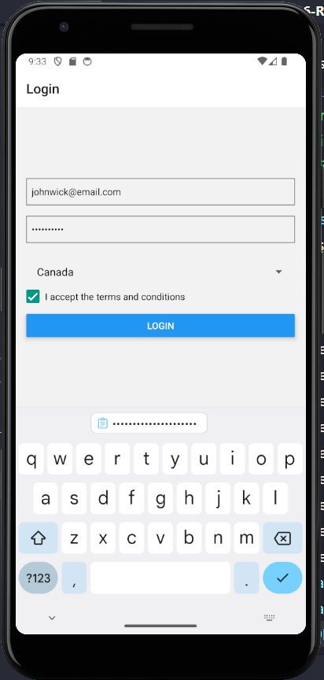
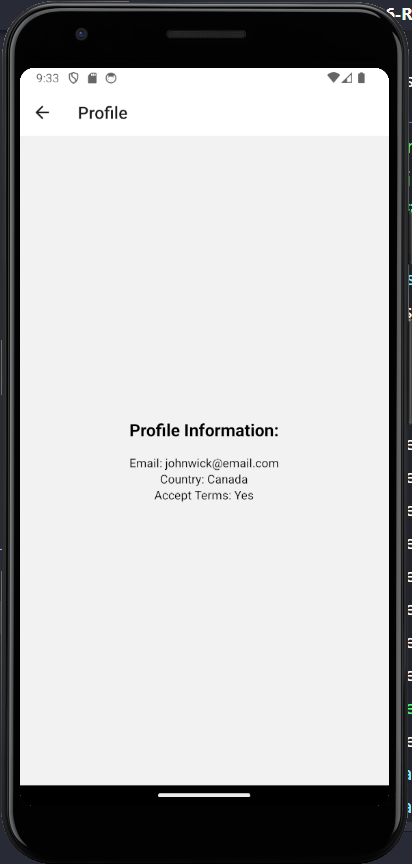

# React Native: Form Handling

## Setting Up the Project

Create a new React Native project using the following command and run it

```
npx create-expo-app comp1786-react-native-form-handling
cd comp1786-react-native-form-handling
npx expo start
```

## Create form

Create a new file called LoginScreen.js in the directory and add the following code:

```js
import React, { useState } from "react";
import { View, TextInput, Button, Alert, StyleSheet } from "react-native";

const LoginScreen = () => {
  const [email, setEmail] = useState("");
  const [password, setPassword] = useState("");

  const handleLogin = () => {
    // Add your form handling logic here (e.g., form validation and API calls).
    // For simplicity, we'll just display the entered email and password in an alert.
    const message = `Email: ${email}\nPassword: ${password}`;
    Alert.alert("Login Information", message);
  };

  return (
    <View style={styles.container}>
      <TextInput
        style={styles.input}
        placeholder="Email"
        onChangeText={(text) => setEmail(text)}
        value={email}
        keyboardType="email-address"
        autoCapitalize="none"
      />
      <TextInput
        style={styles.input}
        placeholder="Password"
        onChangeText={(text) => setPassword(text)}
        value={password}
        secureTextEntry
      />
      <Button title="Login" onPress={handleLogin} />
    </View>
  );
};

const styles = StyleSheet.create({
  container: {
    flex: 1,
    justifyContent: "center",
    paddingHorizontal: 16,
  },
  input: {
    height: 40,
    borderColor: "gray",
    borderWidth: 1,
    marginBottom: 16,
    paddingHorizontal: 8,
  },
});

export default LoginScreen;
```

Now, let's update the App.js file to use the LoginScreen component we just created:

```js
import React from "react";
import { SafeAreaView } from "react-native";
import LoginScreen from "./LoginScreen";

const App = () => {
  return (
    <SafeAreaView style={{ flex: 1 }}>
      <LoginScreen />
    </SafeAreaView>
  );
};

export default App;
```

Finally, run the app


## Adding input validation

We'll check if the email and password fields are not empty before allowing the user to submit the form. We'll also ensure that the entered email is in a valid format. Here's the updated code for the `LoginScreen.js`:

```js
import React, { useState } from "react";
import { View, TextInput, Button, Alert, StyleSheet } from "react-native";

const LoginScreen = () => {
  const [email, setEmail] = useState("");
  const [password, setPassword] = useState("");

  const handleLogin = () => {
    if (validateInputs()) {
      // Add your form handling logic here (e.g., API calls for login).
      const message = `Email: ${email}\nPassword: ${password}`;
      Alert.alert("Login Information", message);
    }
  };

  const validateInputs = () => {
    // Basic email format validation using a regular expression.
    const emailRegex = /^[^\s@]+@[^\s@]+\.[^\s@]+$/;
    if (!email || !password) {
      Alert.alert("Error", "Email and password are required.");
      return false;
    } else if (!emailRegex.test(email)) {
      Alert.alert("Error", "Please enter a valid email address.");
      return false;
    }
    return true;
  };

  return (
    <View style={styles.container}>
      <TextInput
        style={styles.input}
        placeholder="Email"
        onChangeText={(text) => setEmail(text)}
        value={email}
        keyboardType="email-address"
        autoCapitalize="none"
      />
      <TextInput
        style={styles.input}
        placeholder="Password"
        onChangeText={(text) => setPassword(text)}
        value={password}
        secureTextEntry
      />
      <Button title="Login" onPress={handleLogin} />
    </View>
  );
};

const styles = StyleSheet.create({
  container: {
    flex: 1,
    justifyContent: "center",
    paddingHorizontal: 16,
  },
  input: {
    height: 40,
    borderColor: "gray",
    borderWidth: 1,
    marginBottom: 16,
    paddingHorizontal: 8,
  },
});

export default LoginScreen;
```

With this addition, the handleLogin function now checks if the inputs are valid before proceeding to the login logic. If the email or password is empty or if the email is not in a valid format, it will show an alert with an error message.


Now, when the user tries to submit the form with either field empty or with an invalid email format, they will receive appropriate feedback. This helps in ensuring that the user enters valid input before proceeding with any further actions.


## DropDownList

To add a DropDownList (Picker in React Native) to the form, we'll provide a selection of options for the user to choose from. In this example, let's create a DropDownList for selecting the user's country during the login process.

First, we need to install dependency

```
npx expo install @react-native-picker/picker
```

Here's the updated `LoginScreen.js` with the DropDownList

```js
import { Picker } from "@react-native-picker/picker";
import React, { useState } from "react";
import { Alert, Button, StyleSheet, TextInput, View } from "react-native";

const LoginScreen = () => {
  const [email, setEmail] = useState("");
  const [password, setPassword] = useState("");
  const [selectedCountry, setSelectedCountry] = useState("USA");

  const handleLogin = () => {
    if (validateInputs()) {
      // Add your form handling logic here (e.g., API calls for login).
      const message = `Email: ${email}\nPassword: ${password}\nCountry: ${selectedCountry}`;
      Alert.alert("Login Information", message);
    }
  };

  const validateInputs = () => {
    // Basic email format validation using a regular expression.
    const emailRegex = /^[^\s@]+@[^\s@]+\.[^\s@]+$/;
    if (!email || !password) {
      Alert.alert("Error", "Email, password, and country are required.");
      return false;
    } else if (!emailRegex.test(email)) {
      Alert.alert("Error", "Please enter a valid email address.");
      return false;
    }
    return true;
  };

  return (
    <View style={styles.container}>
      <TextInput
        style={styles.input}
        placeholder="Email"
        onChangeText={(text) => setEmail(text)}
        value={email}
        keyboardType="email-address"
        autoCapitalize="none"
      />
      <TextInput
        style={styles.input}
        placeholder="Password"
        onChangeText={(text) => setPassword(text)}
        value={password}
        secureTextEntry
      />
      <Picker
        style={styles.picker}
        selectedValue={selectedCountry}
        onValueChange={(itemValue) => setSelectedCountry(itemValue)}
      >
        <Picker.Item label="USA" value="USA" />
        <Picker.Item label="Canada" value="Canada" />
        <Picker.Item label="UK" value="UK" />
        <Picker.Item label="Australia" value="Australia" />
      </Picker>
      <Button title="Login" onPress={handleLogin} />
    </View>
  );
};

const styles = StyleSheet.create({
  container: {
    flex: 1,
    justifyContent: "center",
    paddingHorizontal: 16,
  },
  input: {
    height: 40,
    borderColor: "gray",
    borderWidth: 1,
    marginBottom: 16,
    paddingHorizontal: 8,
  },
  picker: {
    height: 40,
    borderColor: "gray",
    borderWidth: 1,
  },
});

export default LoginScreen;
```

Run it then we can see the DropDownList


## Checkbox

Let's add a Checkbox to the form to allow the user to accept terms and conditions before logging in.

First, we need to install dependency

```
npx expo install expo-checkbox
```

Here's the updated `LoginScreen.js` with the Checkbox:

```js
import { Picker } from "@react-native-picker/picker";
import Checkbox from "expo-checkbox";

import React, { useState } from "react";
import { Alert, Button, StyleSheet, Text, TextInput, View } from "react-native";

const LoginScreen = () => {
  const [email, setEmail] = useState("");
  const [password, setPassword] = useState("");
  const [selectedCountry, setSelectedCountry] = useState("USA");
  const [isChecked, setChecked] = useState(false);

  const handleLogin = () => {
    if (validateInputs()) {
      // Add your form handling logic here (e.g., API calls for login).
      const message = `Email: ${email}\nPassword: ${password}\nCountry: ${selectedCountry}\nAccept Terms: ${
        isChecked ? "Yes" : "No"
      }`;
      Alert.alert("Login Information", message);
    }
  };

  const validateInputs = () => {
    // Basic email format validation using a regular expression.
    const emailRegex = /^[^\s@]+@[^\s@]+\.[^\s@]+$/;
    if (!email || !password || !isChecked) {
      Alert.alert("Error", "Please fill all the fields and accept the terms.");
      return false;
    } else if (!emailRegex.test(email)) {
      Alert.alert("Error", "Please enter a valid email address.");
      return false;
    }
    return true;
  };

  return (
    <View style={styles.container}>
      <TextInput
        style={styles.input}
        placeholder="Email"
        onChangeText={(text) => setEmail(text)}
        value={email}
        keyboardType="email-address"
        autoCapitalize="none"
      />
      <TextInput
        style={styles.input}
        placeholder="Password"
        onChangeText={(text) => setPassword(text)}
        value={password}
        secureTextEntry
      />
      <Picker
        style={styles.picker}
        selectedValue={selectedCountry}
        onValueChange={(itemValue) => setSelectedCountry(itemValue)}
      >
        <Picker.Item label="USA" value="USA" />
        <Picker.Item label="Canada" value="Canada" />
        <Picker.Item label="UK" value="UK" />
        <Picker.Item label="Australia" value="Australia" />
      </Picker>
      <View style={styles.checkboxContainer}>
        <Checkbox value={isChecked} onValueChange={setChecked} />
        <Text style={styles.label}>I accept the terms and conditions</Text>
      </View>
      <Button title="Login" onPress={handleLogin} />
    </View>
  );
};

const styles = StyleSheet.create({
  container: {
    flex: 1,
    justifyContent: "center",
    paddingHorizontal: 16,
  },
  input: {
    height: 40,
    borderColor: "gray",
    borderWidth: 1,
    marginBottom: 16,
    paddingHorizontal: 8,
  },
  picker: {
    height: 40,
    borderColor: "gray",
    borderWidth: 1,
  },
  checkboxContainer: {
    flexDirection: "row",
    alignItems: "center",
    marginBottom: 16,
  },
  label: {
    marginLeft: 8,
  },
});

export default LoginScreen;
```

With this addition, a Checkbox is included below the DropDownList (Picker) and above the "Login" button. The user can toggle the Checkbox to indicate their acceptance of the terms and conditions. The isChecked state is used to track the checkbox status, and the validation logic now checks whether the checkbox is checked before allowing the user to log in.


## React Navigation

To add navigation to your React Native app, you can use a navigation library like React Navigation. I'll guide you through the steps to implement navigation and display the user information on the Profile Screen after a successful login.

Please note that you'll need to install React Navigation and set up the navigation structure. If you haven't already, you can install it using the following command:

```bash
npm install @react-navigation/native @react-navigation/stack
```

Create a new component for the Profile Screen. Add this component below your `LoginScreen`` component:

```js
// /screens/ProfilesScreen.js
import React from "react";
import { StyleSheet, Text, View } from "react-native";

const ProfileScreen = ({ route }) => {
  const { email, selectedCountry, isChecked } = route.params;

  return (
    <View style={styles.container}>
      <Text style={styles.profileText}>Profile Information:</Text>
      <Text>Email: {email}</Text>
      <Text>Country: {selectedCountry}</Text>
      <Text>Accept Terms: {isChecked ? "Yes" : "No"}</Text>
    </View>
  );
};

const styles = StyleSheet.create({
  container: {
    flex: 1,
    justifyContent: "center",
    alignItems: "center",
    padding: 16,
  },
  profileText: {
    fontSize: 20,
    fontWeight: "bold",
    marginBottom: 16,
  },
  infoText: {
    fontSize: 16,
    marginBottom: 8,
  },
});

export default ProfileScreen;
```

Create a stack navigator and wrap your app with NavigationContainer:

```js
// App.js
import { NavigationContainer } from "@react-navigation/native";
import { createStackNavigator } from "@react-navigation/stack";
import React from "react";
import LoginScreen from "./screens/LoginScreen";
import ProfileScreen from "./screens/ProfileScreen";

const Stack = createStackNavigator();

const App = () => {
  return (
    <NavigationContainer>
      <Stack.Navigator initialRouteName="Login">
        <Stack.Screen name="Login" component={LoginScreen} />
        <Stack.Screen name="Profile" component={ProfileScreen} />
      </Stack.Navigator>
    </NavigationContainer>
  );
};

export default App;
```

Update `LoginScreen` to navigate to the Profile Screen

```js
const handleLogin = () => {
  if (validateInputs()) {
    // ... (your existing logic)

    navigation.navigate("Profile", {
      email,
      selectedCountry,
      isChecked,
    });
  }
};
```

Use `useNavigation()` hook in `LoginScreen`

```js
// Other imports
import { useNavigation } from "@react-navigation/native";

const LoginScreen = () => {
  // ... (your existing code)
  const navigation = useNavigation();
};
```




